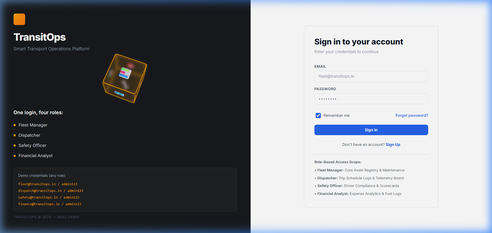
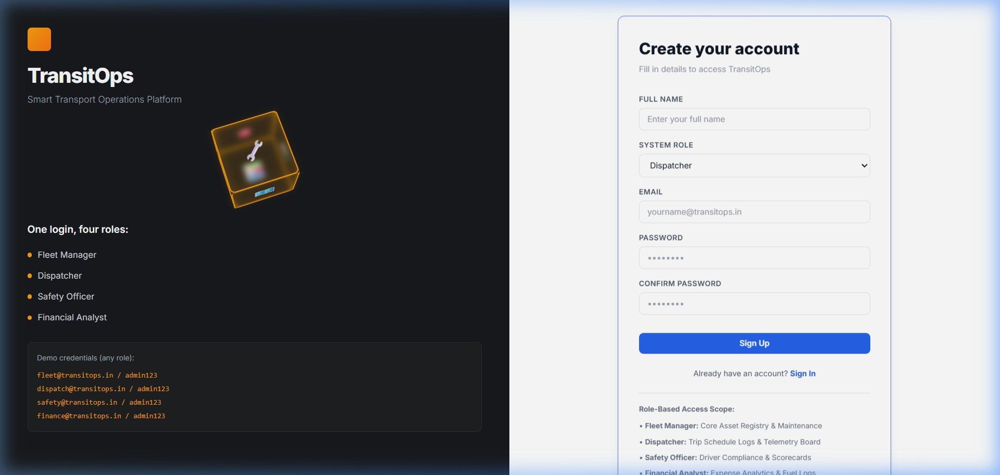
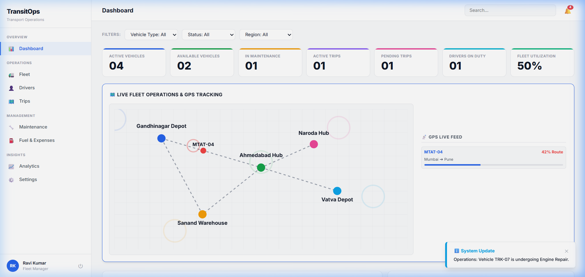
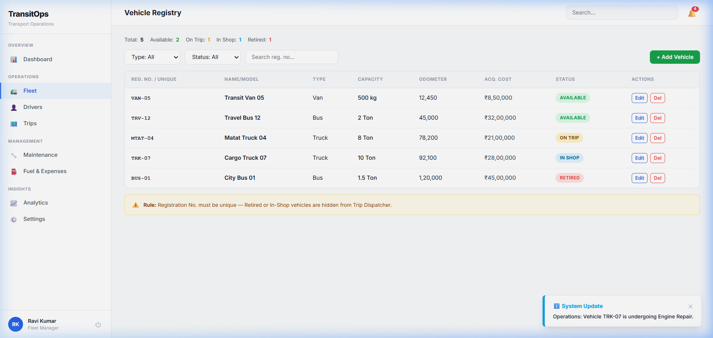
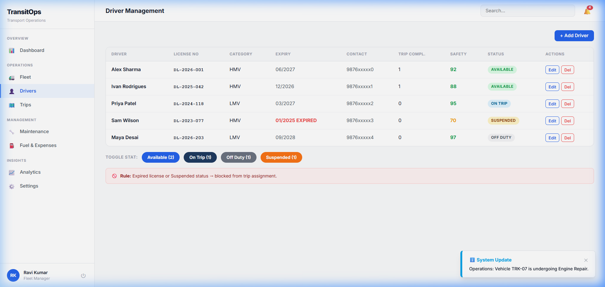
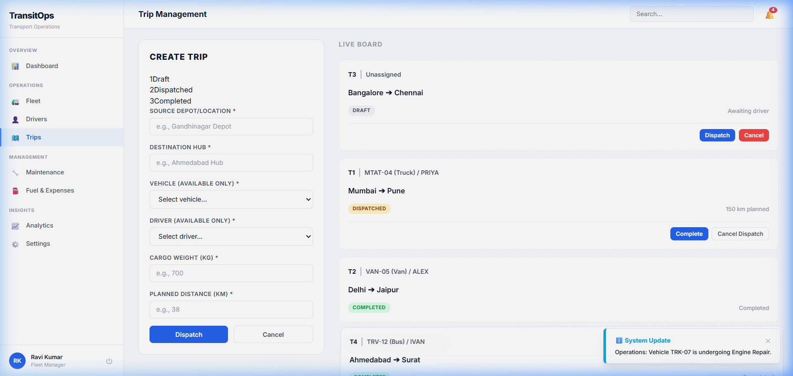
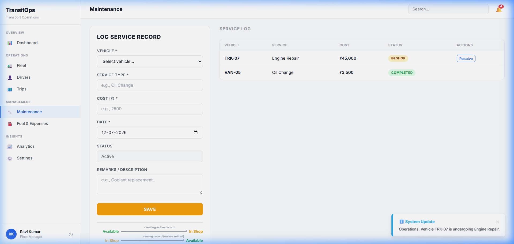
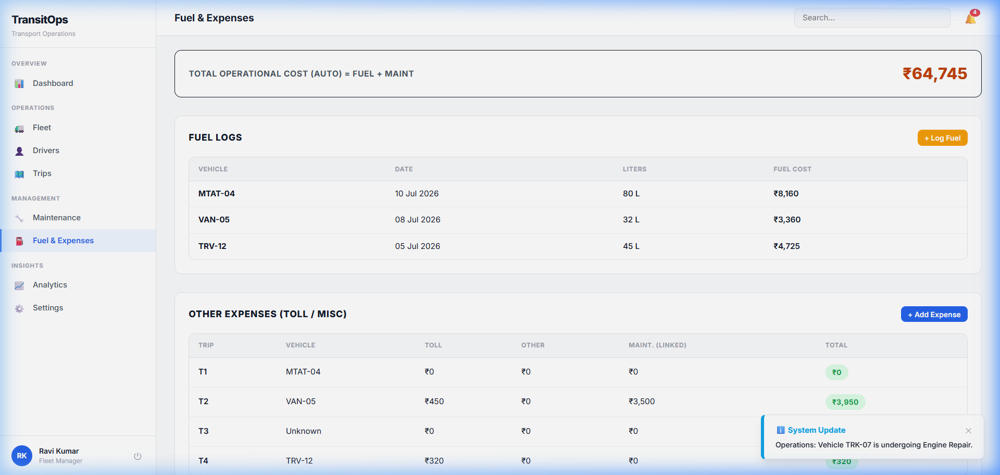
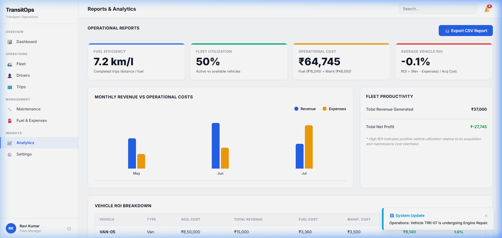
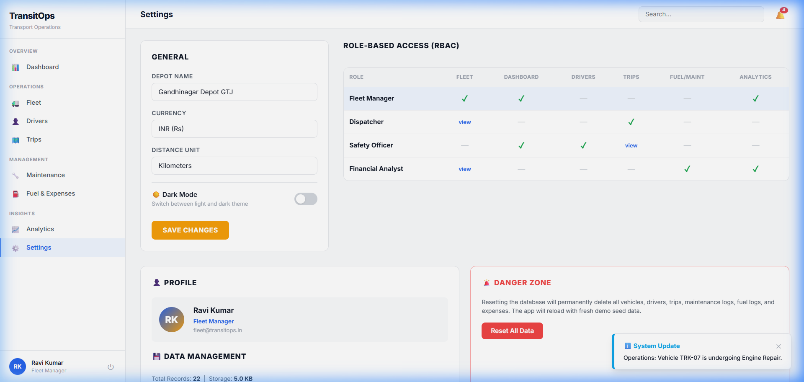

# TransitOps — Smart Transport Operations Platform

TransitOps is a modern, responsive, and hardware-accelerated **Smart Transport Operations Platform** designed for logistics, dispatcher teams, and safety officers to manage vehicles, drivers, trips, fuel metrics, and compliance workflows. 

Built using **React + Vite**, TransitOps utilizes **LocalStorage-backed persistence** to simulate a full-featured backend database natively inside the browser, offering a complete, standalone experience that works out-of-the-box.

---

## 🚀 Key Features & Hackathon Highlight Elements

### 1. 🔑 Role-Based Access Control (RBAC) & Interactive Signup
- **Interactive Forms:** Sign up a new user, specify their System Role, and sign in.
- **Enforced Security Scopes:** The application dynamically adjusts the sidebar navigation layout and locks/grays out features that the current user does not have permission to view or edit:
  - 🛠️ **Fleet Manager:** Has full access to Vehicle Registries, Maintenance schedules, and general configurations.
  - 📡 **Dispatcher:** Focused on scheduling trips, managing drafts, and live dispatch pipelines.
  - 🛡️ **Safety Officer:** Enforces safety metrics, reviews drivers, and maps license validity.
  - 📊 **Financial Analyst:** Handles fuel log analytics, costs tracking, and invoices.

### 2. 🗺️ Live Operations & GPS Simulation Board
- An interactive SVG-based operations map depicting 5 primary hubs and depots (`Gandhinagar`, `Ahmedabad`, `Sanand Warehouse`, `Vatva`, and `Naroda`).
- Vehicles currently **On Route** are animated in real-time along paths with pulsing alert signals.
- Live progress logs and speed tracking are displayed alongside the map, continuously feeding telemetry ticks.

### 3. 🚨 Compliance Scans & Corner Toasts
- Runs diagnostic scans on startup to trigger notifications for low safety ratings, expired driver licenses, or ongoing repair logs.
- Dynamic slide-in **Toast notifications** in the bottom-right corner inform the dispatcher about operational changes in real-time.

### 4. ⛽ Fuel Audit Logs & Auto-ROI Calculator
- Automatically logs fuel consumption audits and updates vehicle odometers when a trip is closed.
- Computes vehicle **ROI** and financial cost-per-kilometer logs.

---

## 📸 Step-by-Step Flow & Screenshots

All flow screenshots are stored in the [screenshots](file:///D:/Hackthon/12 july odoo/TransitOps/screenshots) folder.

### 1. Welcome & Access Portal
Toggle between user authentication and new account registration with matching credentials.

#### Sign In Portal


#### Sign Up & Role Picker


---

### 2. Operations Dashboard
The primary landing hub. Features real-time KPI counts, vehicle status logs, recent trip trackers, and the **interactive SVG tracking map**.



---

### 3. Vehicle Registry
Add, update, or retire vehicles. Checks database constraints for unique registration numbers.



---

### 4. Driver Management & safety
Displays driver license details, license category (LMV/HMV), and safety scores. Expired licenses are flagged automatically.



---

### 5. Trip Dispatcher Board
Draft, configure, and dispatch trips. Validates weight capacity against the assigned vehicle and highlights compliance alerts inline.



---

### 6. Service & Maintenance Logs
Track vehicles sent to repair shops. Sending a vehicle to service automatically marks its status as `In Shop`, preventing dispatch on trips until the service is marked as complete.



---

### 7. Fuel Audit & Expense Ledger
Add fuel bills and miscellaneous logs (e.g. tolls, parking, inspections).



---

### 8. Analytics & Report Center
Visualizes performance summaries, total operational cost allocations, and ROI tables per asset.



---

### 9. Platform Settings & RBAC Audit
Audit system roles and scopes directly in the permissions matrix. Adjust general configurations (Depot name, local currency, unit metrics) and reset or export the entire localStorage database as a JSON backup.



---

## 🛠️ Technology Stack

- **Frontend Core:** React 19 + Javascript
- **Build Tool:** Vite + Rolldown
- **Styling:** Vanilla CSS (Dark/Light mode via CSS Variables)
- **State Management:** React Context (AuthProvider, DataProvider)
- **Virtual DB Layer:** LocalStorage (Autonomous seed-database)

---

## ⚡ Quick Start

### 1. Install Dependencies
```bash
npm install
```

### 2. Run Locally in Development Mode
```bash
npm run dev
```
Open [http://localhost:5173/](http://localhost:5173/) in your web browser.

### 3. Build for Production
```bash
npm run build
```
The compiled output will be generated inside the `dist` folder.
